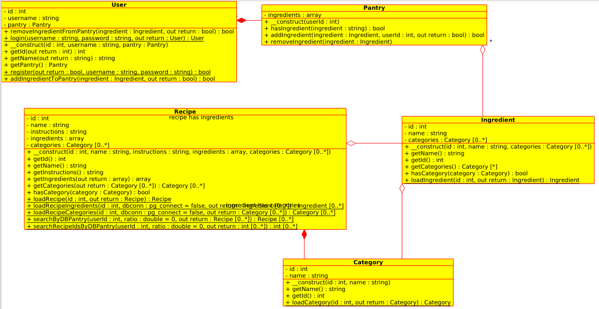

ReadyChef uses both PHP and SQL to manage its data, so I have drawn up both a UML diagram and an ERD.

## Database ERD

The ERD consists of nine tables with eight relationships.

### account:

used to store data about the user account

##### *id* : INT PK

Used to identify a user even if they update their username

##### username : STRING

a unique string used to log in

##### hash : STRING

the user's password hash, including salt and algorithm type

##### password_set : DATETIME

No current plans for this data field, but it can be used to warn the users that their password is getting old, or to force password changes for admins.

### login_history:

used to track login attempts to prevent brute force attacks or DDoS

##### *account_id* : INT FK

Links the login attempt to a user account. It's possible this would be better if it were linked to username instead.

##### success : BOOL

Indicates whether the login attempt was successful (correct password) or failed (incorrect password)

##### login_time : DATETIME

The time of the login attempt

### ingredient:

used to store data about ingredients, and to normalize recipes

##### id : INT PK

A unique identifier for the ingredient. Saves disk space, instead of using VARCHAR as the key

##### name : STRING

The user readable name of the ingredient.

### recipe:

##### *id* : INT PK

Unique identifier for the recipe

##### name : STRING

Not shown in the ERD (by mistake)

User readable name of the recipe

##### instructions : STRING

How to make the recipe, step by step.

### category:

used for sorting recipes and ingredients in order to meet dietary restrictions (e.g. recipes using ingredients with dairy are left out if requested)

##### *id* : INT PK

Unique identifier for the category

##### name : STRING

Human readable name of the category (e.g. dairy, meat, etc)

### user_has_ingredient:

used to create a M:N relationship between users and ingredients

##### account_id : INT FK

relation to account table

##### ingredient_id : INT FK

relation to ingredient table

##### date_purchased : DATE

Allows program to determine expected EOL for food item.

### recipe_has_ingredient:

used to create a M:N relationship between recipes and ingredients, and to provide quantity information.

##### recipe_id : INT FK

relation to recipe table

##### ingredient_id : INT FK

relation to ingredient table

##### quantity : STRING

Allows recipes to list amount of each ingredient necessary (e.g. 2 cups of sugar)

### ingredient_has_category:

used to create a M:N relationship between ingredients and categories

##### ingredient_id : INT FK

relation to ingredient table

##### category_id : INT FK

relation to category table

### recipe_has_category:

used to create a M:N relationship between recipes and categories

##### recipe_id : INT FK

relation to recipe table

##### category_id : INT FK

relation to category table

## PHP UML

For the PHP piece of the puzzle, there are five classes with five relationships. There may be a sixth class (represented by the Cookbook class in the diagram) but I think I will implement those features as functions instead of class methods in order to optimize server response time.

### User: 

This class stores user data, including a pointer to an instance of the Pantry class specific to the user. User data is pulled from the `account` table.

### Pantry:

This class stores the list of ingredients that the User has on hand. It allows the User to add or remove ingredients. Pantry data is pulled from the `user_has_ingredient` table.

### Ingredient:

This class stores data about each ingredient, including a list of categories. Ingredient data is pulled from the `ingredient` table, and the list of categories is pulled from the `ingredient_has_category` table.

### Recipe:

This class stores data about each recipe, as well as a list of categories. Recipe data is pulled from the `recipe` table, and category data is pulled from the `recipe_has_category` table.

### Category:

This class stores category data. Its data is pulled from the `category` table.
